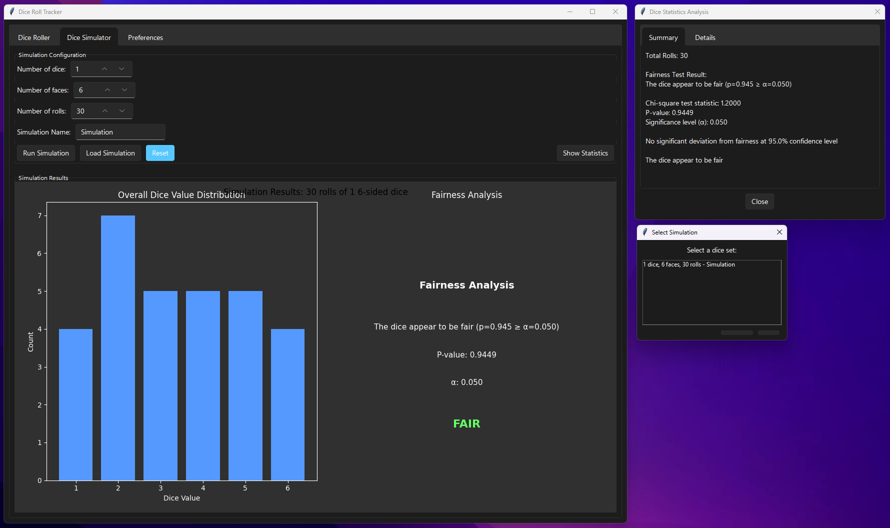
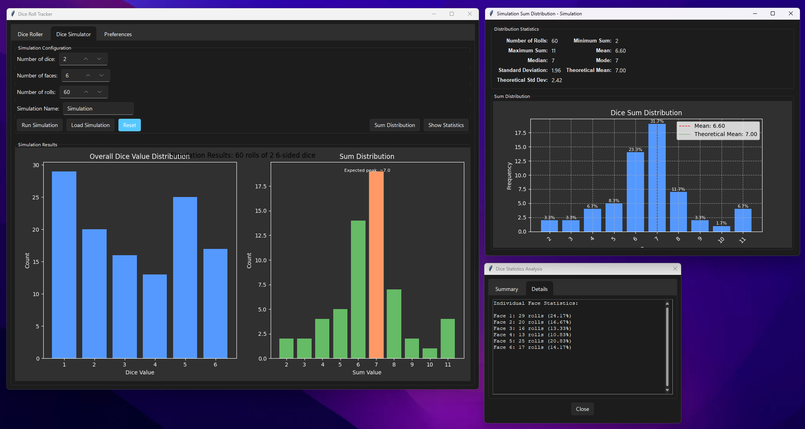

# DiceGraph

A comprehensive tool for tracking, analyzing, and simulating dice rolls. Use this application to check if your dice are fair, visualize roll distributions, and simulate large numbers of dice rolls.
You can also conduct deep statistical analysis on dice roll results to determine dice fairness.

[](https://AnahatMudgal.com)

## Languages and Libraries


|  |
| -------------------------------------- |
|  |

## Features

- **Dice Tracking**: Track rolls for single or multiple dice
- **Custom Dice Support**: Support for dice with any number of faces (d3, d4, d6, d8, d10, d12, d20, d100, etc.)
- **Named Dice Sets**: Save and organize dice sets with custom names
- **Roll Simulation**: Simulate large numbers of rolls quickly
- **Data Visualization**: View distributions and statistics for your dice rolls
- **Statistical Analysis**: Check if your dice are fair using chi-square goodness of fit tests
- **Dark Mode**: Toggle between light and dark themes
- **User Preferences**: Save your preferences between sessions
- **Data Management**: Save, load, and reset dice roll data

## Installation

1. Make sure you have Python 3.7+ installed
2. Clone this repository:
   ```
   git clone https://github.com/yourusername/DiceGraph.git
   cd DiceGraph
   ```
3. Install the required dependencies:
   ```
   pip install -r requirements.txt
   ```

## Usage

### Main Application

Run the full-featured application with:

```
python main.py
```

### Dice Roller Tab

1. Set the number of dice, number of faces, and give your dice set a name
2. Click "Apply" to configure the dice set
3. Roll dice by clicking on the numbered buttons
4. View the distribution graph that updates after each roll
5. Use "Reset Data" to clear all rolls for the current dice set
6. Use "Load Set" to select from previously saved dice sets

### Dice Simulator Tab

1. Configure the simulation parameters (number of dice, faces, and rolls)
2. Give your simulation a name
3. Click "Run Simulation" to generate and visualize the results
4. View fairness statistics to check if the simulated dice are fair
5. The simulation data is automatically saved and can be loaded for further analysis

### Basic Tracker Scripts

For basic traditional dice tracking, the repository includes two simplified standalone scripts:

- **Tracker.py**: A simple tracker for single die rolls with a minimalistic interface

  ```
  python Tracker.py
  ```

  This script provides a straightforward way to track rolls of a single die and shows basic statistics.

- **TrackerN.py**: A tracker for rolling multiple dice sequentially
  ```
  python TrackerN.py
  ```
  This script allows tracking rolls of multiple dice with the same number of faces, recording the sequence of each dice roll.

> **Note:** These scripts are provided for simple use cases only. For the complete feature set including simulation, statistical analysis, and advanced visualization, please use the main application with `python main.py`.

## File Structure

- `main.py`: Application entry point
- `gui.py`: Main application user interface
- `dice_roller.py`: Dice roller tab implementation
- `dice_simulator.py`: Dice simulator tab implementation
- `preferences_tab.py`: User preferences tab implementation
- `dice_manager.py`: Core dice functionality
- `file_utils.py`: File operations for saving/loading dice data
- `simulation.py`: Dice simulation functionality
- `statistics_utils.py`: Statistical analysis utilities
- `user_preferences.py`: User preferences management
- `ui_components.py`: Reusable UI components
- `Tracker.py`: Simple single die tracker
- `TrackerN.py`: Simple multiple dice tracker
- `SingleDiceResults/`: Directory for single dice roll data files
- `MultipleDiceResults/`: Directory for multiple dice roll data files
- `SimulationResults/`: Directory for simulation data files
